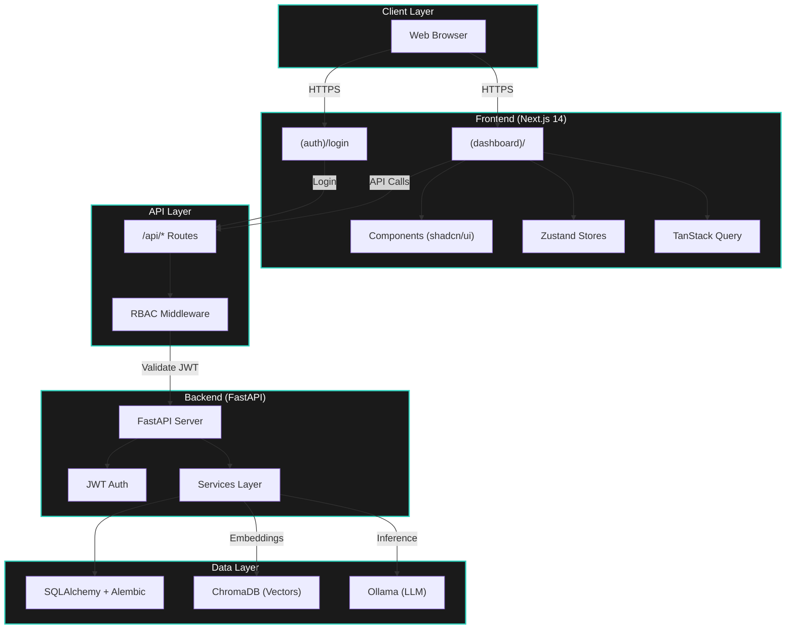

<div align="center">
  
  
  <h1 style="margin-top: 0;">VaultIQ 🔐</h1>
  
  <p><b>"Your financial data never leaves your machine. Period."</b></p>
  
  <p>A privacy-first, RBAC-enforced AI document intelligence platform built for enterprise financial workflows.</p>

  <p>
    <a href="https://github.com/Anudeepsrib/VaultIQ">
      
    </a>
    <a href="https://github.com/Anudeepsrib/VaultIQ">
      
    </a>
    <a href="https://github.com/Anudeepsrib/VaultIQ/blob/main/LICENSE">
      
    </a>
  </p>

  <p>
    <a href="#-core-features">Features</a> •
    <a href="#-quick-start">Quick Start</a> •
    <a href="#%EF%B8%8F-tech-stack">Tech Stack</a> •
    <a href="#-models--llms">Models</a> •
    <a href="#-user-roles--rbac">RBAC</a>
  </p>
  
  <a href="https://github.com/Anudeepsrib/VaultIQ">
    
  </a>
</div>

---

## 🔒 The Privacy-First Promise

VaultIQ is built on the philosophy of complete data sovereignty. Sensitive financial documents should never leave the perimeter.

<table>
  <tr>
    <td width="50%" valign="top">
      <h3>🧠 Local LLM Processing</h3>
      <p>Powered locally via Ollama. All document extraction and RAG queries run on your hardware — zero cloud inference.</p>
    </td>
    <td width="50%" valign="top">
      <h3>🛡️ RBAC-Enforced Access</h3>
      <p>Granular role-based access control (Admin, Analyst, Auditor, Viewer) with JWT authentication and httpOnly cookies.</p>
    </td>
  </tr>
  <tr>
    <td width="50%" valign="top">
      <h3>💾 Sovereign Data Layer</h3>
      <p>All documents, embeddings, and audit logs live inside local SQLite + ChromaDB stores that you alone own and control.</p>
    </td>
    <td width="50%" valign="top">
      <h3>📡 Zero Telemetry</h3>
      <p>No hidden analytics, tracking, or data harvesting. PII detection is built-in. Your financial data stays in your vault.</p>
    </td>
  </tr>
</table>

---

## ✨ Core Features

<table>
  <tr>
    <td width="33%" valign="top">
      <b>📄 Document Intelligence</b><br/>
      Upload and process 10-Ks, 10-Qs, earnings reports, and financial statements. AI-powered structured data extraction with zero manual effort.
    </td>
    <td width="33%" valign="top">
      <b>🔍 RAG Query Engine</b><br/>
      Ask natural language questions across your entire document corpus. Semantic search powered by ChromaDB vector embeddings.
    </td>
    <td width="33%" valign="top">
      <b>📊 Benchmark Suite</b><br/>
      Compare LLM extraction performance with built-in evaluation tools. Measure accuracy, latency, and cost across models.
    </td>
  </tr>
  <tr>
    <td width="33%" valign="top">
      <b>🔐 Enterprise Security</b><br/>
      JWT auth, CSRF protection, RBAC middleware, PII detection, and comprehensive audit logging for full compliance coverage.
    </td>
    <td width="33%" valign="top">
      <b>🎨 Premium UI</b><br/>
      A sleek, dark-mode dashboard built with Next.js 14, shadcn/ui, Radix primitives, and Tremor charts.
    </td>
    <td width="33%" valign="top">
      <b>🎛️ Bring Your Own Model</b><br/>
      Plug in any model via Ollama. Works seamlessly with local edge models like Llama 3.2, Mistral, or Phi-3.
    </td>
  </tr>
</table>

---

## 🚀 Quick Start

Get up and running locally in under 5 minutes.

### 1. Engine Setup
Ensure you have [Ollama](https://ollama.com) installed and pull a model:
```bash
ollama pull llama3.2:latest
```

### 2. Clone & Bootstrap
```bash
git clone https://github.com/Anudeepsrib/VaultIQ.git
cd VaultIQ

# Install frontend dependencies
npm install
```

### 3. Backend Setup
```bash
cd vaultiq

# Set up virtual environment
python -m venv venv
source venv/bin/activate  # Windows: .\venv\Scripts\activate

# Install dependencies
pip install -r requirements.txt

# Run migrations
alembic upgrade head
```

### 4. Launch
Launch two terminal windows to start the backend engine and frontend interface.

**Terminal 1 — FastAPI Backend:**
```bash
cd vaultiq
source venv/bin/activate  # Windows: .\venv\Scripts\activate
uvicorn app.main:app --reload
```

**Terminal 2 — Next.js Frontend:**
```bash
npm run dev
```

Open [http://localhost:3000](http://localhost:3000) to begin processing your financial documents.

---

## 🛠️ Tech Stack

<table>
  <tr>
    <th width="50%">Frontend (App Router)</th>
    <th width="50%">Backend (Data Engine)</th>
  </tr>
  <tr>
    <td valign="top">
      <ul>
        <li><b>Framework:</b> Next.js 14</li>
        <li><b>Styling:</b> Tailwind CSS + shadcn/ui + Radix UI</li>
        <li><b>State:</b> Zustand + TanStack Query v5</li>
        <li><b>Charts:</b> Tremor</li>
        <li><b>Forms:</b> React Hook Form + Zod</li>
        <li><b>Language:</b> TypeScript (Strict)</li>
      </ul>
    </td>
    <td valign="top">
      <ul>
        <li><b>API:</b> FastAPI (Python 3.11+)</li>
        <li><b>Database:</b> SQLAlchemy + Alembic</li>
        <li><b>Vectors:</b> ChromaDB</li>
        <li><b>LLM Engine:</b> Ollama</li>
        <li><b>Auth:</b> JWT + httpOnly Cookies</li>
        <li><b>Infra:</b> Docker + Docker Compose</li>
      </ul>
    </td>
  </tr>
</table>

---

## 🧠 Models & LLMs

We recommend local models with at least 3 Billion parameters for optimal JSON extraction and financial document comprehension.

| Model | Resource Size | Quality/Speed | Best Use Case |
|-------|---------------|---------------|---------------|
| **Llama 3.2 3B** | `~2GB RAM` | ⚡ Fast / Good | Quick iterations, older hardware. |
| **Llama 3.2 7B** | `~4GB RAM` | ⚖️ Balanced | The sweet spot for accuracy and speed. |
| **Mistral 7B** | `~4GB RAM` | 🎨 Creative | Excellent extraction variety and structure. |
| **Phi-3 Mini** | `~2GB RAM` | 🔋 Efficient | Battery-friendly edge computing. |

---

## 👥 User Roles & RBAC

VaultIQ enforces granular role-based access at every layer of the application.

| Role | Permissions |
|------|-------------|
| **Admin** | Full access including user management, system config |
| **Analyst** | Upload documents, run extractions, query RAG engine |
| **Auditor** | Read-only access + full audit log visibility |
| **Viewer** | Read-only document access |

---

## 📁 Document Types Supported

- 10-K / 10-Q (SEC filings)
- Earnings Reports
- Offering Memorandums
- Financial Statements
- Custom document types via schema configuration

---

## ⚙️ Configuration

Your instance can be customized entirely via environment variables:

```env
# Frontend
NEXT_PUBLIC_API_BASE_URL=http://localhost:8000/v1
API_BASE_URL=http://localhost:8000/v1

# Backend — Local Database Persistence
DATABASE_URL=sqlite:///./vaultiq.db
JWT_SECRET=your-jwt-secret-here

# AI Provider targeting a local Ollama instance
OLLAMA_BASE_URL=http://localhost:11434
```

---

## 🏗️ Architecture Flow



---

## ⚠️ Disclaimer
**Enterprise Use Only:** VaultIQ is a secure document intelligence platform. It does **not** provide financial advice, investment recommendations, or regulatory filings. Users should consult qualified financial and legal professionals for compliance matters.

---

<div align="center">
  <p>Built with 🔐 for teams that take data privacy seriously.</p>
</div>
